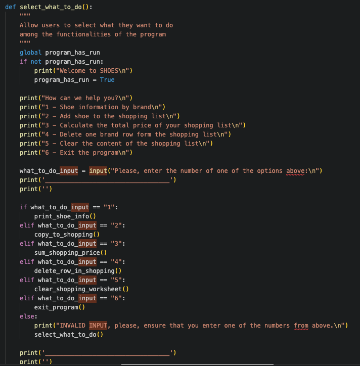
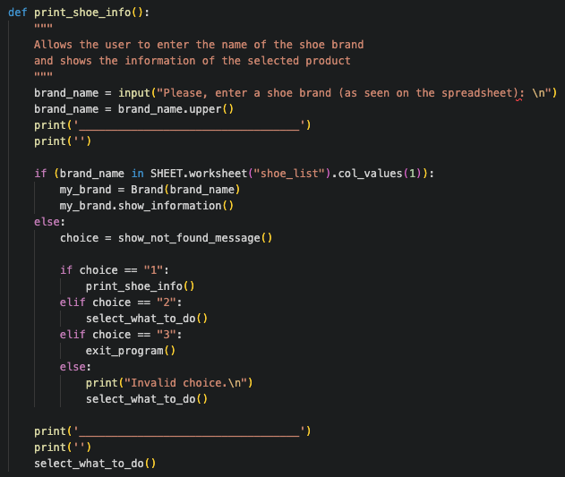
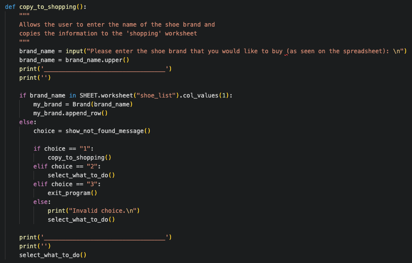
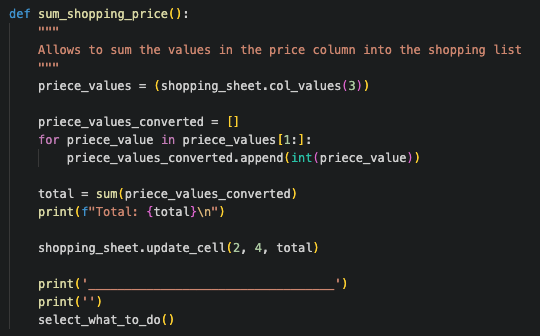
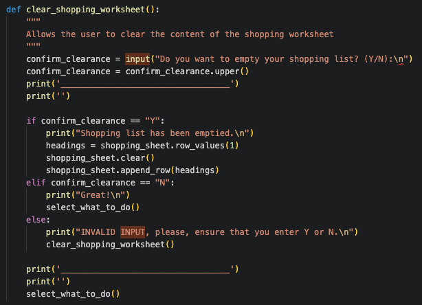
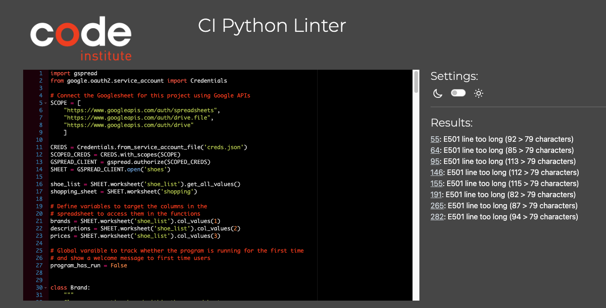

# SHOES

This is a program to analyse information hosted in a Google Sheet named shoes. The data set of the sheet was taken from Kaggle and modified to adapt it to the functionalities required. It is being created as an example of program designed to search into a data set for the desired information and to analyse the data within this sheet. The program was designed to be user-friendly and functional. This program was built as a third project of the agenda to become a Full Stack Software Development at Code Institute. The requirement was to build program using python.

---

## CONTENTS

- [SHOES](#shoes)
  - [CONTENTS](#contents)
  - [Planning of the project](#planning-of-the-project)
  - [Features](#features)
    - [How to use the program](#how-to-use-the-program)
    - [Functions](#functions)
    - [Future implementations](#future-implementations)
    - [Imported libraries](#imported-libraries) 
  - [Technologies used](#technologies-used)
    - [Languages used](#languages-used)
  - [Deployment](#deployment)
  - [Testing](#testing)
    - [Validation testing](#validation-testing)
    - [Manual testing](#manual-testing)
    - [Bugs](#bugs)
  - [Credits](#credits)
    - [Content](#content)
    - [Acknowledgments](#acknowledgments)

---

## Planning of the project

It was followed the next diagram for the creation of the program: 

It was used [Lucid](https://www.lucidchart.com/) to create this diagram.

The spread sheet was taken from [Kaggle](https://www.kaggle.com/datasets/justinpakzad/net-a-portermr-porter-fashion-dataset?select=mr-porter.csv/) website.

This data set was imported to Google sheets and modified to fulfil the needs of the project. Here it can be found the link to the used [Google sheet shoes](https://docs.google.com/spreadsheets/d/1U53KSj0bVGPkZ_-dJj4_UMKLcY-6U65M0p_dOBjbdAo/edit#gid=58565426)

## Features

### How to use the program

- The user type in commands via terminal following the instructions given in it, as shown in the image below, and using the numeric index of the options provided.

### Functions

Each function has a description of their functionality.

This program allows the user to perform the following actions by selecting them in the terminal menu:

- Select what they want to do from the options given within the menu in the terminal.

- Search for shoe by brand name and get information of the item from the Google sheet.

- Copy selected data to the Google sheet to create a shopping list.

- Sum the price of the items located in the shopping list.

- Delete an item from the shopping list.

- Clear the shopping list.

- Exit the program.

### Future implementations

Implement more filtering option like filter items by price range, material of the shoe, etc.

### Imported libraries

It was imported gspread in order to be able to access the Google sheet. It was imported Credentials from google.oauth2.service_account to use the creds.json file to set up authentication needed to access the created Google Cloud project.

## Technologies used

**GitHub** – storage 
**Codeanywhere** – IDE used to write, edit, commit and push the code to GitHub 
**Heroku** – deployment 
**Am I Responsive?** – check responsiveness of the website 
**Google Sheet** – spread sheet host 
**Python** - build the program, python 3 via terminal to test the program 
**Javascript** - code included in the template used, provided by CodeInstitute 
**Google Chrome** - test the program 
**LucidChart** - create the flow chart 

### Languages used

- Python
- Javascript

## Deployment

The site was deployed to Heroku.
The project was developed in CodeAnywhere application, where it was committed and pushed to GitHub. Then it was deployed in Heroku via Github repository.
The project was deployed to Heroku following the steps for deployment from the video of the Love Sandwiches project (CopdeInstitute), which are described below:
1.  Open Heroku website
2.  Log into the account using your own credentials
3.  Select 'New' on the right side of page and then select 'Create New App'
4.  Insert App Name - must be unique
5.  Insert Region 
6.  Select 'Create App'
7.  From the next page select 'Settings' tab
8.  On the next page scroll down and select 'Reveal Config Vars'
9.  In the box labelled 'KEY' enter 'CREDS'
10. In the box labelled 'VALUE' copy and paste content of 'creds.json' file from codeanywhere workspace for the project
11. Click 'Add'
12. In the next box labelled 'KEY' insert 'PORT'
13. In the box labelled 'VALUE' insert 8000
14. Click 'Add'
15. Scroll down into the page and in the section labelled 'Buildpacks' select 'Add buildpack'
16. Select the box labelled 'python' and then select 'Save Changes'
17. Select 'Add buildpack' once again and select the box labelled 'nodejs' and select 'Save Changes' 
    NOTE: Buildpacks must be in correct order, Python on top and Nodejs below
18. Scroll up to the top of the page and select the tab labelled 'Deploy'
19. In the 'Deployment Method' section select 'GitHub'
20. Below, select 'Connect to GitHub'
21. Search for the GitHub repository name in the 'repo-name' box and select 'Search' and when the name appears select 'Connect'
22. Scroll down to 'Manual Deploys' and select 'Deploy Branch'  
    Automatic Deploys may also be used
24. Below 'Deploy Branch' the app can be seen to be created
25. A button saying 'View' will appear when completed
26. Select View and the app will open in a new tab where mock terminal can be seen

The live link can be found here - https://shoes-772087c4c0ff.herokuapp.com/

## Testing

### Validation testing

It was used [PEP8](https://pep8ci.herokuapp.com/#) to test the written code with the following result:

The only error that appears is "E501 line too long" for print or input statements as well as for comments within the code, not affecting the performance of the program.

The program was tested in the local terminal and the CodeInstitute Heroku terminal.

### Manual testing

| Feature | Expected Outcome | Testing Performed | Result | Pass/Fail |
| --- | --- | --- | --- | --- |
|  |  |  |  |  |
| Invalid inputs | An invalid input/choice should appear printed in the terminal and a new message should appear either repeating the previous question or redirecting to the amin menu | Different kinds of invalid inputs entered in the terminal for each of the options provided in the menu | Redirected to the main menu or to the previous request. | Pass |
| Functionality of the function select_what_to_do| Run the function associated to the selected number in the main menu | Enter, one at the time, each of the numbers of the main menu in the terminal | Desired function run correctly | Pass |
| Functionality of the rest of functions | Run the function associated to the selected number in the main menu | Enter, one at the time, each of the numbers of the main menu in the terminal | Selected function run correctly | Pass |
| --- | --- | --- | --- | --- |

 - - -

Following devices and browsers were used:

Laptop:

- Macbook Pro 
  
Browser:

- Google Chrome

### Bugs

No bugs were found.

## Credits

- The spreadsheet for this app was imported from [Kaggle](https://www.kaggle.com/) and can be found [here](https://www.kaggle.com/datasets/justinpakzad/net-a-portermr-porter-fashion-dataset)
- The link to the spreadsheet used for the project is [here](https://docs.google.com/spreadsheets/d/1U53KSj0bVGPkZ_-dJj4_UMKLcY-6U65M0p_dOBjbdAo/edit#gid=58565426)

### Content

Love Sandwiches was used as reference to plan the project and set it up. Content was written and created by the developer with inspiration from other CodeInstitute student projects. 

### Acknowledgments

My mentor Luke for continuous support and helpful feedback.

